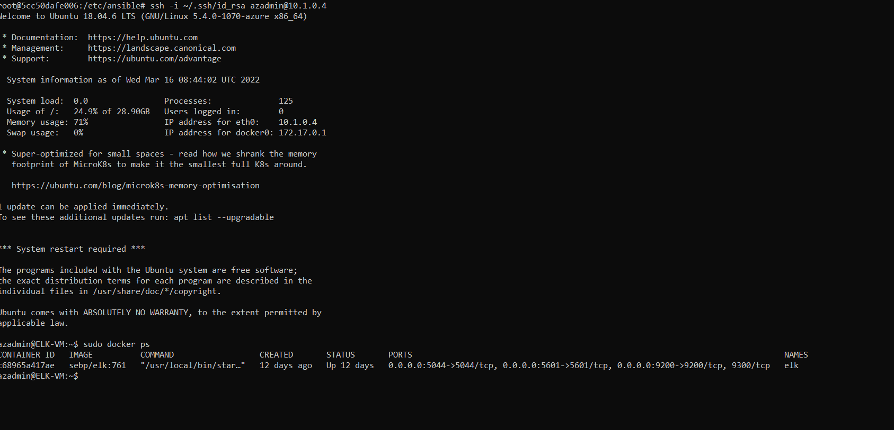

## Automated ELK Stack Deployment

The files in this repository were used to configure the network depicted below.

These files have been tested and used to generate a live ELK deployment on Azure. They can be used to either recreate the entire deployment pictured above. Alternatively, select portions of the playbook file may be used to install only certain pieces of it, such as Filebeat.

  - _TODO: Enter the playbook file._

This document contains the following details:
- Description of the Topologu
- Access Policies
- ELK Configuration
  - Beats in Use
  - Machines Being Monitored
- How to Use the Ansible Build

### Description of the Topology

The main purpose of this network is to expose a load-balanced and monitored instance of DVWA, the D*mn Vulnerable Web Application.

Load balancing ensures that the application will be highly available, in addition to restricting access to the network.
- _TODO: What aspect of security do load balancers protect? What is the advantage of a jump box?_

Integrating an ELK server allows users to easily monitor the vulnerable VMs for changes to the data and system logs.
- _TODO: What does Filebeat watch for?_
Filebeat is a lightweight shipper for forwarding and centralizing log data. Installed as an agent on your servers, Filebeat monitors the log files or locations that you specify, collects log events, and forwards them either to Elasticsearch or Logstash for indexing
- _TODO: What does Metricbeat record?_
Metricbeat is a lightweight shipper that you can install on your servers to periodically collect metrics from the operating system and from services running on the server. Metricbeat takes the metrics and statistics that it collects and ships them to the output that you specify, such as Elasticsearch or Logstash

The configuration details of each machine may be found below.
_Note: Use the [Markdown Table Generator](http://www.tablesgenerator.com/markdown_tables) to add/remove values from the table_.

| Name     | Function | IP Address | Operating System |
|----------|----------|------------|------------------| 
| Jump Box | Gateway  | 10.0.0.4   |Linux(ubuntu 18.04)|
| web-1    | Container| 10.0.0.5   |Linux(ubuntu 18.04)|
| web-2    |Container | 10.0.0.6   |Linux(ubuntu 18.04)|
| web-3    |Container | 10.0.0.7   |Linux(ubuntu 18.04)|
| Elk-VM   |Container | 10.1.0.4   |Linux(ubuntu 18.04)|

### Access Policies

The machines on the internal network are not exposed to the public Internet. 

Only the jump box provisioner machine can accept connections from the Internet. Access to this machine is only allowed from the following IP addresses:220.240.158.62 

Machines within the network can only be accessed by jumpbox provisioner.
- _TODO: Which machine did you allow to access your ELK VM? What was its IP address?_

A summary of the access policies in place can be found in the table below.

| Name        | Publicly Accessible | Allowed IP Addresses |
|----------   |------------------|----------------------|
| Jump Box    |   Yes            | 220.240.158.62       |
|Load Balancer|   yes            |     52.147.36.181    |
|web-1        |    No            |     10.0.0.5         |
|web-2        |    No            |     10.0.0.6         |
|web-1        |    No            |     10.0.0.7         |
|web-1        |    No            |     10.1.0.4         |

### Elk Configuration

Ansible was used to automate configuration of the ELK machine. No configuration was performed manually, which is advantageous because...
- _TODO: What is the main advantage of automating configuration with Ansible?_
### Configuration Management:
Ansible is designed to be very simple, reliable, and consistent for configuration management
### Application Deployment:
Ansible lets you quickly and easily deploy multitier apps. You won’t need to write custom code to automate your systems
### Orchestration:
Ansible uses automated workflows, provisioning, and more to make orchestrating tasks easy
### Security and Compliance:
As with application deployment, sitewide security policies (such as firewall rules or locking down users) can be implemented along with other automated processes
### Cloud Provisioning:
With Ansible, you can provision cloud platforms, virtualized hosts, network devices, and bare-metal servers

The playbook implements the following tasks:
- _TODO: In 3-5 bullets, explain the steps of the ELK installation play. E.g., install Docker; download image; etc._
* Install docker.io -Install docker container within the host
* Install python3-pip - to use in container
* Increase the memory before we run the container
* Add published ports
* Enable docker service - enables the docker service to be used

The following screenshot displays the result of running `docker ps` after successfully configuring the ELK instance.

### Target Machines & Beats
This ELK server is configured to monitor the following machines:
- _TODO: List the IP addresses of the machines you are monitoring_ 10.0.0.5, 10.0.0.6, 10.0.07

We have installed the following Beats on these machines:
- _TODO: Specify which Beats you successfully installed_
* Filebeat
* Metric Beat

These Beats allow us to collect the following information from each machine:
### Filebeat:
Filebeat is a lightweight shipper for forwarding and centralizing log data. Installed as an agent on your servers, Filebeat monitors the log files or locations that you specify, collects log events, and forwards them either to Elasticsearch or Logstash for indexing

### Metric Beat
Metricbeat is installed on the different servers in your environment and used for monitoring their performance, as well as that of different external services running on them

### Using the Playbook
In order to use the playbook, you will need to have an Ansible control node already configured. Assuming you have such a control node provisioned: 

SSH into the control node and follow the steps below:
- Copy the File beat configuration file to ansible container.
- Update the filebeat configuration file file to include your ELK server's IP address. the default credentials are elastic:changeme
-Run ansible-playbook filebeat_playbook.yml and ensure there are no errors.
- Run the playbook, and navigate to Filebeat installation page on the ELK server GUI <http://ELK server dynamic IP:5601/app/kibana#/dashboard/> to check that the installation worked as expected. scroll to module status and click check data.
- scroll to bottom and click on verify incoming data.

_TODO: Answer the following questions to fill in the blanks:_
- _Which file is the playbook? Where do you copy it?_
filebeat-playbook.yml and metricbeat-playbook.yml are copied to /etc/ansible/roles

- _Which file do you update to make Ansible run the playbook on a specific machine? How do I specify which machine to install the ELK server on versus which to install Filebeat on?_
* filebeat configuration and metricbeat configuration file are updated on elk server.Since Filebeat is built to collect data about specific files on remote machines, it must be installed on the VMs you want to monitor
- _Which URL do you navigate to in order to check that the ELK server is running?
<http://20.70.27.157:5601/app/kibana#/dashboard/>

_As a **Bonus**, provide the specific commands the user will need to run to download the playbook, update the files, etc._
curl https://gist.githubusercontent.com/slape/5cc350109583af6cbe577bbcc0710c93/raw/eca603b72586fbe148c11f9c87bf96a63cb25760/Filebeat >> /etc/ansible/roles/filebeat-playbook.yml